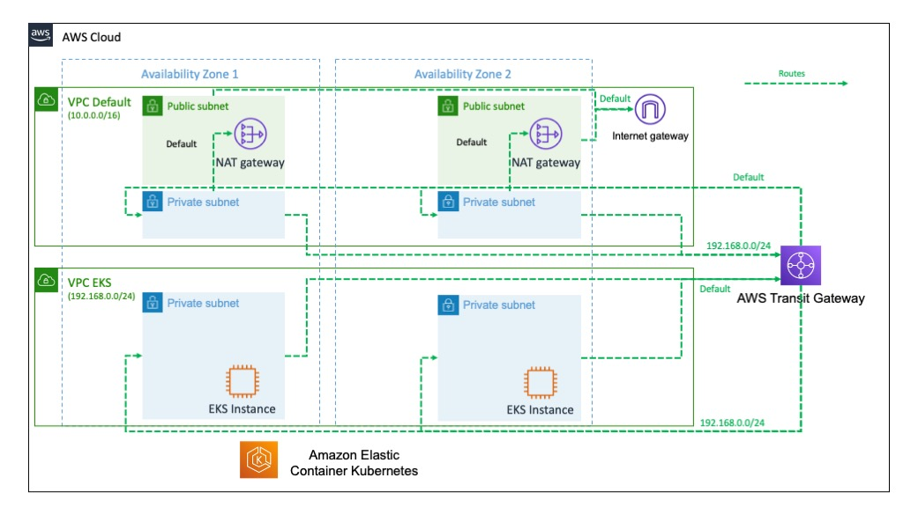
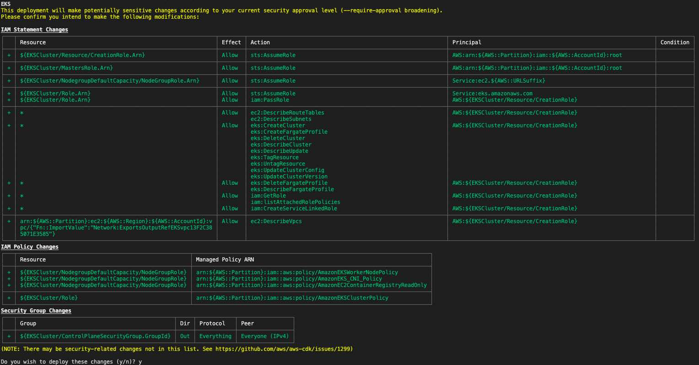

# Challenge
In an corporate IT context, the use of an network entry and exit point might be required.  This can be to centralize the network flows through a *Next Generation Firewall*  or to flow all the cloud traffic through the corporate network.


# Design

This network design takes this requirement in consideration and allows all in and out traffic to pass through the "default" network.  This design was build to support an [AWS EKS](https://aws.amazon.com/eks) cluster but can be adapted to other service deployments.



In this example, the use of a an [AWS Nat gateway](https://docs.aws.amazon.com/vpc/latest/userguide/vpc-nat-gateway.html) as well and an [AWS internet gateway](https://docs.aws.amazon.com/vpc/latest/userguide/VPC_Internet_Gateway.html) can be replaced by another route.  For example an [AWS VPN](https://aws.amazon.com/vpn/) or a [AWS Direct Connect](https://aws.amazon.com/directconnect/).


Here is another reference in the AWS Blogs:
[Creating a single internet exit point from multiple VPCs Using AWS Transit Gateway](https://aws.amazon.com/blogs/networking-and-content-delivery/creating-a-single-internet-exit-point-from-multiple-vpcs-using-aws-transit-gateway/)


# Install CDK

[AWS CDK getting started](https://docs.aws.amazon.com/cdk/latest/guide/getting_started.html) guide to install CDK.


You can also consider following the [AWS CDK Workshop](https://cdkworkshop.com/) to get a hands on tour.


# Prepare the environment.


```console

foo@bar:~$ python3 -m venv .venv/
foo@bar:~$ source .venv/bin/activate
foo@bar:~$ pip install -r requirements.txt
foo@bar:~$ cdk synth
foo@bar:~$ cdk bootstrap
foo@bar:~$ cdk deploy --all

```

You may see a warning since EKS requires IAM resources.  Please review and approve if you are satisfied with the proposed changes.

