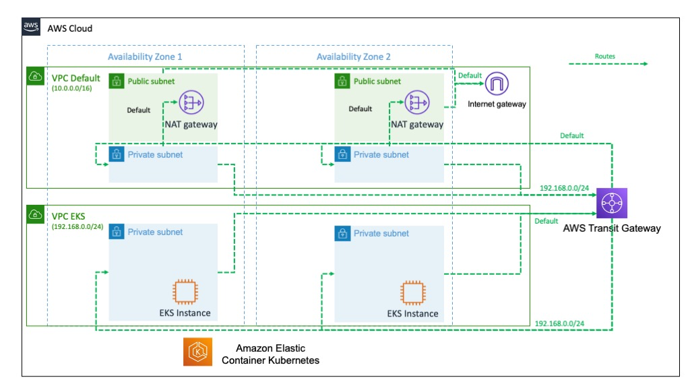

# Challenge
In an corporate IT context, the use of an network entry and exit point might be required.  This can be to centralize the network flows through a *Next Generation Firewall*  or to flow all the cloud traffic through the corporate network.


# Design

This network design takes this requirement in consideration and allows all in and out traffic to pass through the "default" network.  This design was build to support an [AWS EKS](https://aws.amazon.com/eks) cluster but can be adapted to other service deployments.



In this example, the use of a an [AWS Nat gateway](https://docs.aws.amazon.com/vpc/latest/userguide/vpc-nat-gateway.html) as well and an [AWS internet gateway](https://docs.aws.amazon.com/vpc/latest/userguide/VPC_Internet_Gateway.html) can be replaced by another route.  For example an [AWS VPN](https://aws.amazon.com/vpn/) or a [AWS Direct Connect](https://aws.amazon.com/directconnect/).


Here is another reference in the AWS Blogs:
[Creating a single internet exit point from multiple VPCs Using AWS Transit Gateway](https://aws.amazon.com/blogs/networking-and-content-delivery/creating-a-single-internet-exit-point-from-multiple-vpcs-using-aws-transit-gateway/)


# How to use

## Install Terraform.
https://learn.hashicorp.com/tutorials/terraform/install-cli

## Deploy this Template.

```shell
$ export AWS_PROFILE=containers
$ export AWS_REGION=us-east-1
$ export TF_VAR_region=$AWS_REGION
$ terraform init
$ terraform plan
$ terraform apply -auto-approve
$ aws eks --region $AWS_REGION update-kubeconfig --name eks1

```


